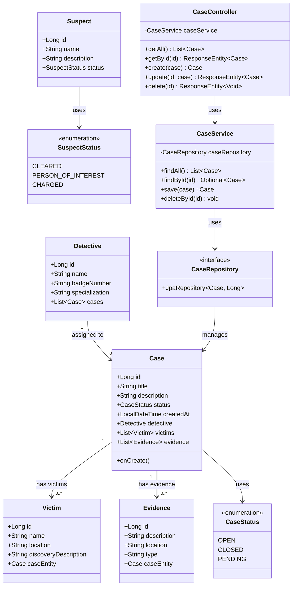

# Class Diagram - Las Cariñosas Investigation System

## UML Class Diagram (Mermaid)



## Package Structure

```
com.lunalunera.investigation
├── InvestigationApplication.java
├── config/
│   └── SecurityConfig.java
├── controller/
│   ├── CaseController.java
│   ├── VictimController.java
│   ├── SuspectController.java
│   ├── EvidenceController.java
│   └── DetectiveController.java
├── service/
│   ├── CaseService.java
│   ├── VictimService.java
│   ├── SuspectService.java
│   ├── EvidenceService.java
│   └── DetectiveService.java
├── repository/
│   ├── CaseRepository.java
│   ├── VictimRepository.java
│   ├── SuspectRepository.java
│   ├── EvidenceRepository.java
│   └── DetectiveRepository.java
└── model/
    ├── Case.java
    ├── Victim.java
    ├── Suspect.java
    ├── Evidence.java
    ├── Detective.java
    ├── CaseStatus.java
    └── SuspectStatus.java
```
