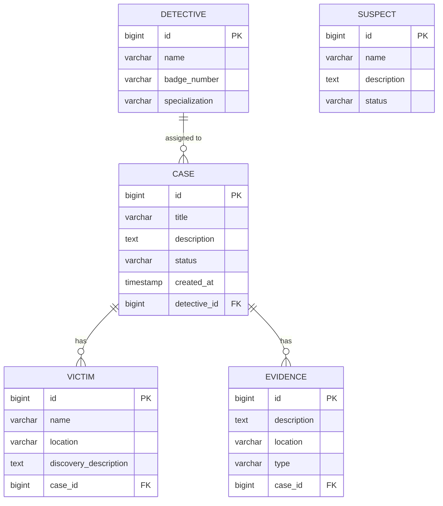

# Entity Relationship Diagram - Las Cariñosas Investigation System

## ERD (Mermaid)

## Relationships

| Relationship | Cardinality | Description |
|---|---|---|
| Detective → Case | One-to-Many | One detective can be assigned to multiple cases |
| Case → Victim | One-to-Many | A case can have multiple victims |
| Case → Evidence | One-to-Many | A case can have multiple pieces of evidence |
| Suspect | Standalone | Suspects exist independently (may be linked to cases via investigation) |
